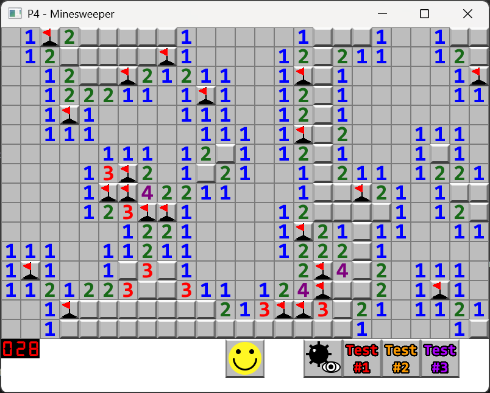

<H1> Minesweeper SFML </h1>
A clone of Minesweeper made with SFML. Submitted as final project for COP3504C Advanced Programming Fundamentals. 

 

Featrues a debug mode to view locations of mines and 3 different pre-made test boards. The test boards can be modified in `src/boards/`, with 1 denoting a mine and 0 denoting an empty tile.